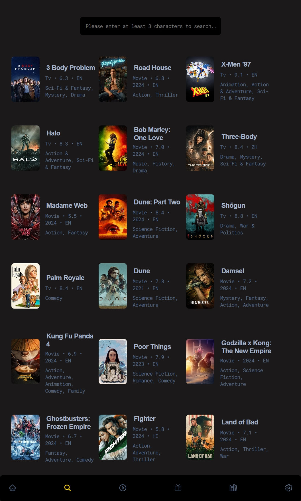
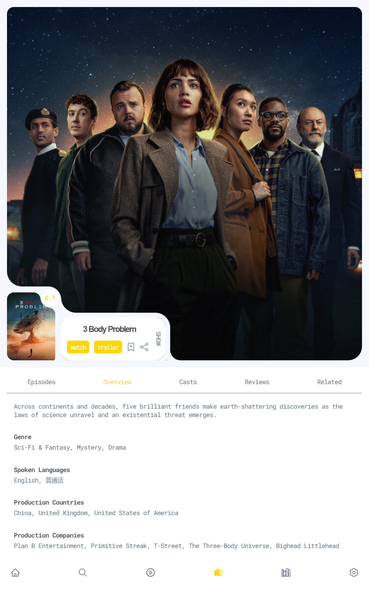
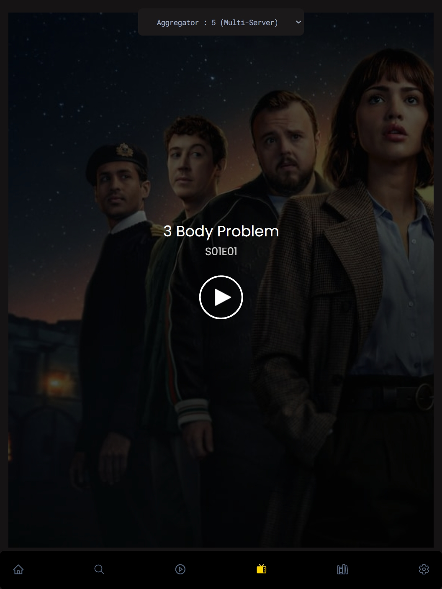
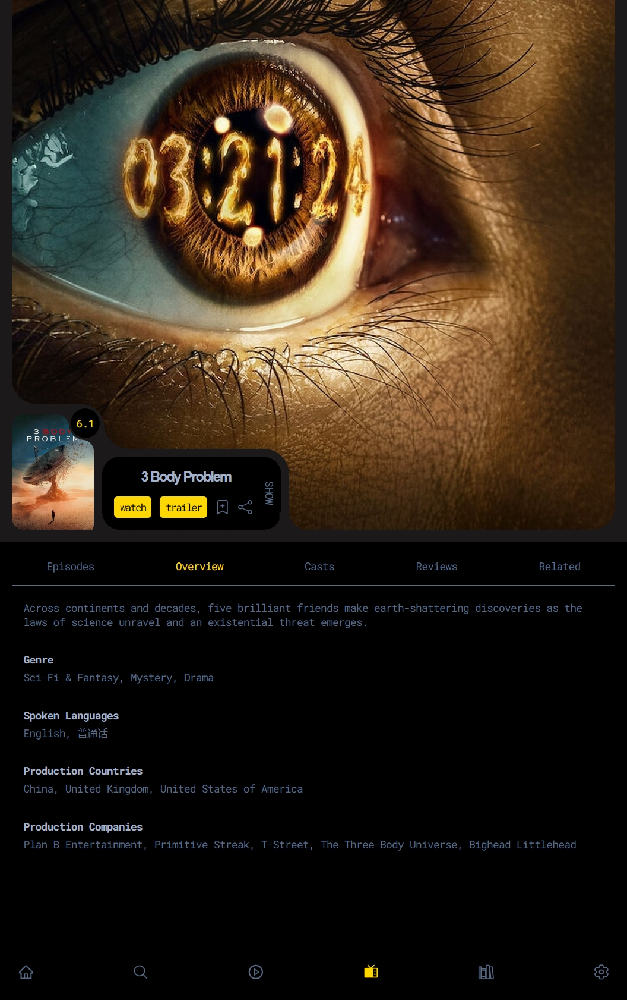

<!-- 
 -->

<image src="./public/images/logo.svg" height="300"/>

Your Personal Streaming Oasis

  

# **_Rive_**

Rive is a cutting-edge platform for streaming movies and TV shows online. Our project utilizes Next.js. Your Personal Streaming Oasis

 

 

## **Features**:

- Created using [NextJS](https://nextjs.org/) framework and [TypeScript](https://www.typescriptlang.org/).
- Watchlist and Continue watching feature using **localstorage**
- Sync to cloud option (firestore), for watchlist
- Login/ Signup for cloud syncing
- Signin with email, or google (firebase)
- Multiple server streaming
- Download Movies/ TV shows using extensions like FetchV
- Great Customization in settings
- Great UI

## **Word From Developer**:

> 1. **For AD-Free experience** : Use AD-Block services for AD-free experience, like AD-Blocker extension or [Brave Browser](https://brave.com/)

> 2. **For Movie/TV shows Download** :
>    Use video downloader extensions like
>
> - on PC : [FetchV](https://fetchv.net/) or [Stream Recorder](https://www.hlsloader.com/)
> - on Mobile : [AVDP](https://play.google.com/store/apps/details?id=videoplayer.videodownloader.downloader)
>
> [The Source](https://www.reddit.com/r/DataHoarder/comments/qgne3i/how_to_download_videos_from_vidsrcme/)

## **Tech Stack**

    
    
    
    
    

## **Screenshots**

Here are some screenshots on various devices

| Macbook                                                        | iPad                                                | iPhone                                                         |
| -------------------------------------------------------------- | --------------------------------------------------- | -------------------------------------------------------------- |
|  |  |  |
|  |  |  |
|  |  |  |
|  |  |  |
| -                                                              |  | -                                                              |
